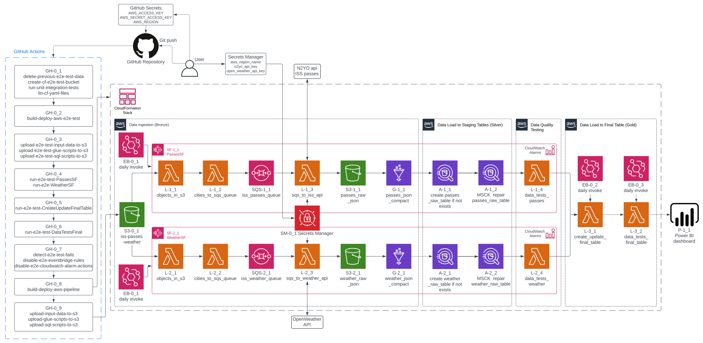
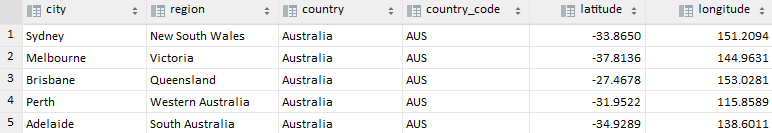
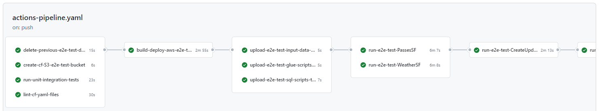
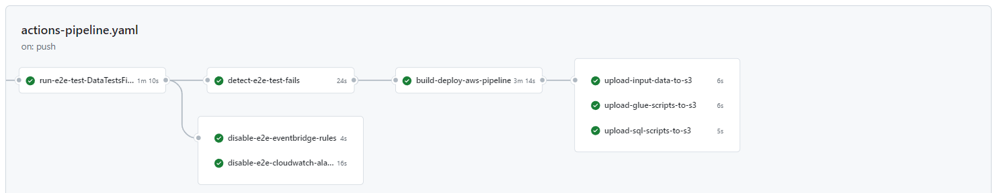
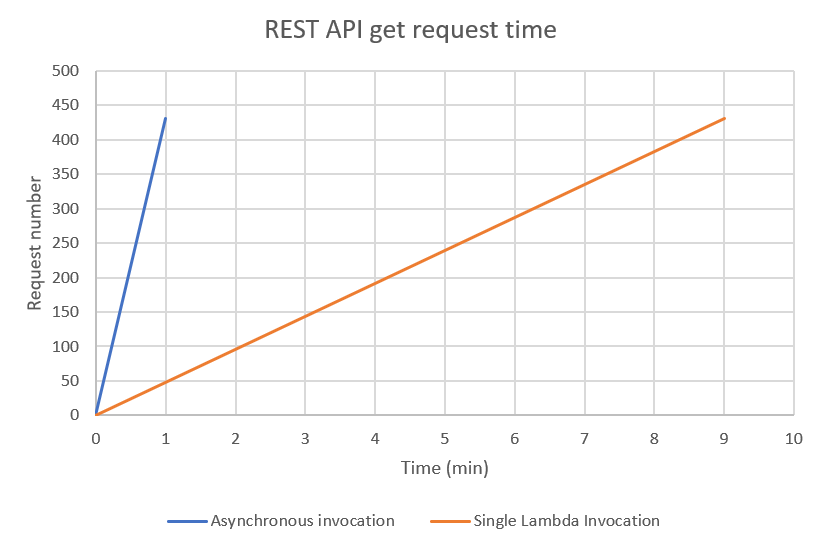
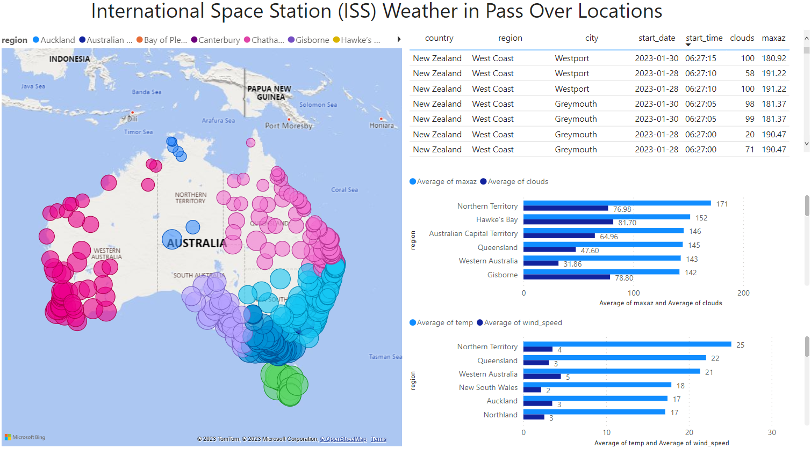

Source: NASA

## ISS Weather Pipeline Summary

This pipeline takes in Australia and New Zealand city data (e.g. country, region, lat, lon, timezone etc.), feeds this data into a satellite tracker
API (N2YO) and weather API (OpenWeather) and produces a one big table (OBT) showing the weather conditions when the International Space Station (ISS) 
passes over a particular city.

It is a complicated project with many moving parts, therefore, patience will be required to understand how everything links together.

This pipeline costs approx. $5 US per month to run for around 430 cities and data is gathered every day therefore querying in Athena is not
available until the first lot of data has been ingested and loaded to the Glue tables. The cost to scale it has not been estimated yet, however,
it is not expected to scale linearly.

### Pipeline features at a glance:

* Continuous integration / continuous deployment (CI/CD) - *GitHub Actions*
* Infrastructure-as-Code (IaC) of AWS microservices - *AWS SAM in GitHub Actions*
* Unit (*Unittest*), integration (*Unittest and Moto*) and end-to-end testing (e2e) (*AWS CLI and bash*) - *GitHub Actions on push*
* AWS and API key security - *GitHub Actions and AWS Secrets Manager*
* Logging, alarming and email notifications if pipeline fails - *AWS CloudWatch and SNS*
* Data quality tests e.g. check that all cities are processed, check for duplicates etc. - *AWS Lambda and Athena*
* Dashboarding - *MS Power BI*

Click to view

## Table of Contents

[Project Objective](#Project-Objective) 
[Pipeline Objective](#Pipeline-Objective) 
[Data Sources](#Data-Sources) 
[Pipeline Features](#Pipeline-Features) 
[Selection of AWS Microservices](#Selection-of-AWS-Microservices) 
[Dashboard](#Dashboard) 
[Deploy Project](#Deploy-Project) 

## Project Objective

The primary objective of this project was to learn about data engineering and its key concepts by building a data pipeline. As not only a beginner
to data engineering but also programming, it was identified at various points throughout the project that in order for this project to succeed and 
for others to learn from this project, that software development and software engineering best practices had to be incorporated as much as possible. 
Examples of this include infrastructure-as-code (IaC) and testing, both of which have hugely benefited the project and my learning.

Whilst every attempt has been made to create a project that is "technically correct", given that there are many ways to do the same "thing", there
are no doubt elements that people with disagree with (e.g. using CloudFormation for IaC!). I do however hope that others can learn a great deal
from this project and perhaps implement some of the components into their own projects.

## Future Improvements

* Expand the unit and data quality testing to provide better coverage
* Include weekly and monthly reporting via Lambda invoked Athena SQL queries

## Pipeline Objective

The objective of this serverless AWS pipeline is to deliver data for the analysis of International Space Station (ISS) passes over Australia and
New Zealand (However, this project can also be used for the US as well, and other countries may be added in the future).

This pipeline has been designed so that:

* It can run without a computer running (i.e. it is run automatically in the cloud daily with no manual operation required)
* It is serverless, which means that the microservices are externally managed and costs are only incurred when the microservices are used
* The number of countries and cities can be scaled easily (subject to API limits)

## Data Sources

### Input Data

A csv file containing Australia and New Zealand city location data (e.g. country, region, lat, lon, timezone etc.) was used as input into the APIs.
See https://simplemaps.com/data/world-cities for the original "Basic" dataset that was used. The key data in this csv file is the latitude and
longitude, which is used as inputs into both APIs.

*Note: The US has also been included, see app/s3/input data for the input data files*

### Returned Data

Two APIs were used for getting of the data:

- N2YO API (left image): ISS forecast pass data for each city location
- OpenWeather API (right image): weather forecast data for each city location

What is noticeable by looking at the returned json data is that the date and time is given in UTC format in both APIs (i.e. "StartUTC" for the N2YO
API, which is the UTC date and time of the ISS being visible at a particular latitude and longitude, and "dt" for the OpenWeather API, which is UTC
date and time of the weather forecast). Using this connection, the data can be joined to get the weather conditions as the ISS passes over a
particular
city.

N2YO has a rate limit of 1000 requests/hr as standard (this can be increased upon approval by N2YO admin), whilst OpenWeather has 1000
requests/day under their free tier. As such, the 431 Australia and New Zealand city locations fall within the rate limits of these APIs.

 

## Pipeline Features

### CI/CD

Continuous integration / continuous deployment forms an integral part of this pipeline in that it allows for a full deployment of the pipeline
instead of manually creating, updating or deleting AWS microservices in the AWS console, which can be both time-consuming and causes many a headache!
This includes the setup of an S3 bucket for the CloudFormation stack, running of unit and integration tests, linting of CloudFormation YAML
template files, deployment of the AWS microservices and uploading of the input data, glue scripts and SQL scripts to S3. Additionally, other jobs
like the invoking of the step and Lambda functions are included as part of the e2e testing that is also incorporated into the CI/CD pipeline.

The GitHub Actions workflow template is located at .github/workflows/actions-pipeline.yaml.

### IaC

IaC for the AWS microservices occurred using CloudFormation templates that were built and deployed using AWS's Serverless Application Model (SAM)
package. Whilst SAM was designed for serverless applications, it can also be used to deploy any AWS microservice specified in CloudFormation
templates. Additionally, nested stacks have been used so that instead of one very long template.yaml file, there are many smaller templates,
therefore making it more manageable.

### Security

Security features implemented into the pipeline included AWS IAM roles and permissions with least privilege, key security using GitHub Secrets for
AWS keys and AWS Secrets Manager for API keys, and encryption and bucket versioning for S3.

  
More detail

**Principle of Least Privilege** -
Access to AWS resources is provided by IAM access roles and permissions. If a user is not setup correctly to
interact with these AWS resources, they may not be able to perform the required work at the required time (i.e. don't
have required permissions) or at worst, may be given too much access resulting in accidental damage to the pipeline or
data. Every effort was made to set up each resource's policies with least privilege as opposed to using '*' on the action and resource, or using the
AWS managed policies. In both cases, these can result in too many priveleges given to the user. The exception to this was the CloudWatch Lambda
Function alarms where resources were specified as '*' due to circular dependencies.

Least privileges can be seen in the CloudFormation template .yaml files in the app directory.

**Key Security** -
It is important that AWS credentials (i.e. Access Key and Secret Access Key) and API keys are not hardcoded into
pipelines to ensure these can't be taken and used by non-authorised users. AWS credentials were manually stored in
GitHub Secrets and then accessed by AWS SAM when deploying the nested CloudFormation stack. The N2YO and OpenWeather API
keys were manually stored in AWS Secrets Manager and then used by the L-1_3 and L-2_3 Lambda functions.

Key security can be seen in .github/workflows/actions-pipeline.yaml, app/Lambdas/passes-template.yaml, app/Lambdas/weather-template.yaml and
app/Lambdas/functions/functions.py

**Encryption** -
All objects in S3 bucket are automatically encrypted by S3 using their default server-side encryption "Amazon S3-managed keys" SSE-S3. Even though
the data in S3 is not considered sensitive or confidential, and as a personal learning project does not need to meet industry or regulatory
requirements, it is good practice to consider encryption as it forms a critical component of data privacy and security.

Encryption is automatically applied to S3 buckets on creation.

**S3 Bucket Versioning** -
Enabled so that if data is overwritten in S3 with new data, the old data can be recovered. This may occur by manually running
L-1_3 "sqs_to_iss_api" and L-2_3 "sqs_to_weather_api" Lambda functions instead of it running automatically in Step Functions.

Bucket versioning can be seen in app/s3/template.yaml

### Testing

Unit and integration testing of the pipeline may occur locally (using the GitHub actions local workflow tool "act" ) or within GitHub Actions upon
committing and pushing the latest code changes to GitHub. For the unit tests, Python's native Unittest package was used to detect errors in the
Python functions used in the AWS Lambda functions. For the integration tests, AWS's Moto package (which mocks AWS resources) was used to detect
errors in the functions that use AWS's Boto3 package. The unit and integration tests can be seen in the tests/ directory.

For e2e testing, this occurs within GitHub Actions by invoking Step Functions, Lambda functions and other AWS microservices using the AWS CLI with 
bash scripting, which is pre-installed into GitHub Actions. The e2e test works by deploying the same CloudFormation template as what's used in the 
final stack with certain parameters changed via the parameter-overrides flag in AWS SAM. Examples include the test file to be used, which only 
contains 5 cities instead of all the cities and "-test" added to the end of certain resource parameters to differentiate them from the final 
resources. Following deployment of the e2e stack, the SF-1_1: PassesSF and SF-2_1: WeatherSF Step Functions are invoked and then the L-3_1:
create_update_final_table and L-3_2: data_tests_final_table are invoked. At this point, GitHub Actions won't know if there's a failure on the AWS
side, therefore, the CloudWatch logs are parsed to determine if "ERROR" or "FAIL" keywords (the "FAIL" keyword is logged when a data test fails) 
appear, if so, the GitHub Actions worflow fails and the subsequent steps, which includes the deployment of the final CloudFormation stack, does 
not occur. Additionally, there are workflow jobs that disable the e2e stacks EventBridge rules and CloudWatch alarms so that the test stack's 
pipeline is not invoked and errors aren't logged, and also a workflow job that deletes the test stacks S3 data at the start of the workflow. This 
ensures that the workflow can be run on Git push each time without failing because of objects already existing in the test S3 bucket. 

See .github/workflows/actions-pipeline.yaml for the e2e tests.

*Note: mocking Boto3 with Moto is also often referred to as unit testing instead of integration testing, the latter of which typically involves
calling of the actual services, not mocking them. It appears there is some conjecture and a definitive answer could not be found.*

### Idempotency

Idempotency can be defined as:

*"... the property of an operation whereby it can be applied multiple times without changing the result
beyond the initial application. You can run an idempotent operation safely multiple times without any side effects like
duplicates or inconsistent data."* Jerome Van Der Linden and Dariusz
Osiennik https://aws.amazon.com/blogs/compute/handling-Lambda-functions-idempotency-with-aws-Lambda-powertools

In terms of the data pipeline itself, idempotency basically means that the pipeline can run multiple times, either by mistake or on purpose, and the
data in the tables remains accurate and not duplicated.

The concept of idempotency also applies to other operations in this project. See the more detail section for more information.

  
More detail

**AWS CloudFormation** -
CloudFormation is AWS's native infrastructure as code (IaC) solution. All the AWS resources used in this project were
specified and configured in yaml templates for deployment with AWS SAM through GitHub Actions. One of the core concepts of IaC is
that it should be idempotent, e.g. AWS SAM should only change resources that have been modified no matter how many times SAM
deploys the CloudFormation stack.

**AWS Lambda** -
Due to the rate limits of the APIs (N2YO - 1000 requests/hr and OpenWeather - 1000 requests/day) if the Lambda functions are run too many times,
the API keys will get blocked and the pipeline will fail due to a KeyError. However, whilst this may not be considered idempotent, due to
EventBridge cron jobs invoking the step and Lambda functions each day, exceeding the APIs rate limits should not be an issue unless they are
manually invoked.

The OpenWeather API is not idempotent in itself, in that if it is called hours later, it will return different start and end times for the forecast
and the values are subject to change slightly based on the weather forecast data underpinning it. Therefore, it is important that it runs on a
schedule via EventBridge to avoid gaps in the data and if it is manually called hours later and the outputted json files overwritten for that day,
that the old data can be recovered due to S3 bucket versioning.

**AWS SQS** - To avoid duplication of json data, the Step Functions run the L-1_1 and L-2_1 "objects_in_s3..." Lambda functions first. These
Lambda functions check whether the required number of objects already exist in the S3 bucket (for AUS and NZ this is 431, which is specified in
the root CloudFormation template), if they do then an error is raised and the Step Function fails, if they don't (i.e. there's no objects or
there are objects, but not the full 431) then the Step Function continues.

A dead letter queue (DLQ) was also implemented as a safety net if a message could not be processed by the downstream consumer (AWS Lambda in this
case). If a message cannot be processed by AWS Lambda after a specified number of retries (maxReceiveCount property), it is delivered to the DLQ.
The main purpose of the DLQ is to allow for the analysis of why messages have failed to be processed by the consumer and whilst it doesn't ensure
idempotency, it does assist in determining the root cause of failure so that corrections can be made to the code and/or infrastructure and
improving the overall robustness of the architecture.

**AWS Athena** - Currently, there is no way to use UPDATE with Athena because it reads the data from files in S3 and S3 files cannot be changed by
Athena. Because of this, if INSERTS are run multiple times (for example, L-3_1: create_update_final_table Lambda function is run multiple times
within a day) then there will be duplicates. As such, Athena is not idempotent in this regard. This is a relatively easy problem to solve in that if
duplicates are detected, and they will be due to the scheduled L-3_2: data_tests_final_table Lambda function, then it can be manually resolved by
deleting the partitions from the table in Glue.

### Orchestration

AWS Step Functions was used to orchestrate the execution of different resources within the pipeline. The image below shows the SF-1_1
"PassesSF" Step Function flow from the Step Function's Workflow Studio. Each Step Function was programmed using the native Step Functions "states
language" and then copied into the CloudFormation templates for deployment with AWS SAM. Note that the SF-2_1 "WeatherSF" flow is exactly the same,
just with slightly different Lambda functions, Glue jobs and Athena queries.

  
More detail

The first task "L-1_1: objects_in_s3" is used to count the number of objects in the bucket. If it is = 431 (i.e. the number of cities in the 
Australia and New Zealand input data csv file) then this indicates that the pipeline has been run already today. If this is the case
then the pipeline fails in order to avoid making excessive API calls for that day and to avoid overwriting the data. If the data must be
overwritten, then the Lambda Functions can be run manually.

Also note that a pass state is used for "L-1_3: sqs_to_iss_api" due to the Lambda function being invoked by "L-1_2: City data to SQS queue". Given 
that it doesn't need to be invoked by the Step Function, a pass state is used as an indicator.

****

### Logging and Alerting

**Logging** - Incorporated into each Lambda function by using Python's inbuilt logging module to write specific information into the CloudWatch logs.
CloudWatch logging was enabled for each Lambda function in its own CloudFormation policy.

**Alerting** - CloudWatch alarms have been incorporated so that if an error occurs during the execution of the pipeline and its microservices, an
email alert is sent to the SNS topic subscriber specified in the root CloudFormation template.yaml file. Alerting is designed to inform the topic
subscriber when a specified metric limit exceeds a specified threshold so that the root cause can be determined and a fix can be applied in a timely
manner.

CloudWatch alarms have been set up for the following scenarios:

* A Step Function has a failed step (MetricName: ExecutionsFailed)
* A Lambda function that is not called within the Step Functions (e.g. L-1_3 "sqs_to_iss_api" and L-2_3 "sqs_to_weather_api", which are invoked
  asynchronously for their respective SQS queues), returns an error (MetricName: Errors)
* A data quality test returns an "Error" or "FAIL" keyword. The "Error" and "FAIL" keywords are specified in the logging level and logging messages,
  respectively. "Error" was included to also capture any other potential errors. (custom metric with "?FAIL ?Fail ?fail ?ERROR ?Error ?error"
  filter pattern)

The setup of the CloudWatch alarms can be seen in app/cloudwatch/template.yaml.

### Compaction

To improve query performance in Athena, the 431 json files that are written to S3 each day from the L-1_3 "sqs_to_iss_api" and L-2_3
"sqs_to_weather_api" Lambda functions were compacted (i.e. joined together into a larger file) using a Glue Spark job. Without the compaction,
each time Athena queries the individual json files in the S3 bucket, it opens, reads and closes each json file resulting in extended query times
due to the extra overhead, and more S3 reads, both of which increase costs. Whilst the 431 small json files that are ingested daily from each api is
hardly going to effect performance or cost, if this project were to be scaled up significantly to include cities from all around the world,
performance and cost could suffer considerably.

*Note: whilst compaction using a Glue Spark job was included, this was for learning/example purposes only and would not be recommended unless it
was determined to best fit. It is also possible to compact the json files using a Lambda function or a Glue Python shell job, which, depending on
the number and size of the files, may be quicker and less expensive than using Spark.*

### File Format

Parquet files store the data in a columnar format whereby columnar databases (such as Redshift, Trino/Presto and Google BigQuery) and
columnar query engines (such as Athena, which is built from Presto) can use this format to isolate the data scanned to certain columns in a row as
opposed to needing to search through all columns in a row. The compacted json files were output from the Glue Spark job as a parquet file with the
default "snappy" compression, 128 MB block size and 1 MB page size.

Parquet is not required at the current scale of the project, however, once scaled to include more cities (e.g. 40,000+) then it could be a suitable
choice.

### Partitioning

Partitioning was used with the compacted parquet files to allow for more control over the amount of data scanned when querying in Athena.
Additionally, it allows for more control over adding (using MSCK repair) and deleting partitions from the tables. The data was partitioned by the
date it was added to S3, whereby the Hive format of "year=", "month=" and "day=" was used, and was set by simply saving the compacted json parquet
files with the same prefix (.e.g bucket/iss-passes-raw-json-compacted/year=/month=/day=/filename). This choice of partitioning based on date, was
selected because of the way the data was most likely going to be queried and analysed in Athena.

Originally, Glue Crawlers were used but this caused errors in schema identification i.e. the data in the json files would sometimes be inferred
as a different type to what was in the originally inferred destination table and therefore caused failures in the pipeline. I could not determine a
way of fixing this problem at the time, therefore, the above method was used instead, which from research appears to be the most common method of
ingesting data from S3, anyway.

## Selection of AWS Microservices

As this is an AWS project and as there are many AWS microservices existing within the AWS product range, it is important that the AWS microservices
selected are appropriate for the type and size of the source data and also appropriate for the end use case.

The selection of the microservices used in this project was based on self research and through trial and error, and may not be the most
appropriate but should also not be the least appropriate. Reasons for selection of the microservices is explained in More detail.

  
More detail

### AWS Lambda

Lambda was selected due to being serverless and because API data is ingested at a cadence of one day. They are cheap, run only when required and
can be invoked asynchronously.

### AWS SQS

By implementing an SQS queue, the Lambda function responsible for sending get requests to the APIs was able to be invoked asynchronously resulting 
in the ability to horizontally scale the number of API requests made. For example, if using one Lambda for all get requests to OpenWeather API, it 
took approx. 9 min for 431 requests. If the number of cities were to scale up (e.g. 40,000 locations), it would well and truly exceed the Lambda 
function 15 min run limit. When using an SQS queue to asynchronously invoke the Lambda function with 10 SQS messages per batch, it took approx. 1 
min for 431 requests.

Note that for the free account OpenWeather API, the limit is stated as 60 calls per minute, however, completing 431 calls in a minute was  able to 
be achieved. When scaling up to e.g. 40,000 locations, it may be that there are rate limits in place that would cause the pipeline to fail. This 
should be considered in the design phase of the project.

### AWS Step Functions

As AWS's native workflow orchestrator, Step Functions was selected to allow for the easy execution of the ISS passes and ISS weather
pipelines. Originally, EventBridge rules were used to invoke the Lambda functions on a schedule but this seemed a bit clunky to manage. Then
invoking a Lambda function from another Lambda function was investigated, again, this seemed clunky. Finally, Step Functions were investigated and
determined to be the best solution. Step Functions allowed for better organisation, visualisation, invocation, and even the ability to run Athena
queries direct from a task within the Step Function.

  
More detail

The initial creating of the raw passes and raw weather tables (i.e. A-1_1: "passes_raw_table" and A-2_1: "weather_raw_table", respectively) and
the MSCK repairs of these tables (i.e. A-1_2 and A-2_2, respectively) were executed in Athena directly from a Step Function task in both SF-1_1:
"PassesSF" and SF-2_1: "WeatherSF". Note that Lambda functions can be used instead to achieve the same result, however, it does add more
complexity due to the need to create the required Lambda function resources and necessary policies.

## Dashboard

A dashboard was created in MS Power BI as it has the Simba connector that can be used for AWS Athena. The dashboard was a minor part of the
project and a web link to view the final dashboard may be included at a later date.

## Deploy Project

An IDE or code editor with the Python 3.9 interpreter installed and a GitHub account are required for this project. You'll also need an AWS
account with an administrator user set up. If you don't already have this set up, follow the guides below. Note that whilst the guides are for AWS
Kinesis, they can still be used for this project.

1. Set up an AWS account and create administrator user by following this guide: https://docs.aws.amazon.com/streams/latest/dev/setting-up.html.
   Take note of your AWS account access key and secret access key because we will be using it later.
2. Set up the AWS Command Line Interface (CLI) by following this guide: https://docs.aws.amazon.com/streams/latest/dev/setup-awscli.html

### Steps

1. Clone this repository to your local hard drive.
2. Set up the repository as a project in your IDE or code editor and git initialise it
3. Create a repository for this project in your GitHub account and then on the instruction page, copy and paste the code from the "...or push an
   existing repository from the command line" option into your terminal. Note that the first commit will fail in GitHub Actions because the
   project hasn't been set up correctly yet.
4. In the project's repository, go to Settings > Security > Secrets and then Variables > Actions and then create the following
   secrets. Note that the names must be the SAME as shown below. If not then the names can be changed in .github/workflows/actions-pipeline.yaml.

* AWS_ACCESS_KEY_ID: enter your AWS account access key
* AWS_SECRET_ACCESS_KEY: enter your AWS account secret access key
* AWS_REGION: enter your region
* AWS_ACCOUNT_ID: enter your AWS account id

5. Go to https://www.n2yo.com/login/register/ and register for an N2YO account. Once registered, log in to get your api license key. Take note of
   this key because we'll be using it later.
6. Go to https://home.openweathermap.org/users/sign_up and register for an OpenWeather account. Once registered, sign in to get your api license 
   key for the free plan. Take note of this key because we'll be using it later.
7. Go to your AWS accounts console, search Secrets Manager and then go to the console page. Store a new secret then click on "Other type of
   secret". Under"Key/value pairs", enter the following secrets. Note that the names must be the SAME as shown below. If not then delete the secret
   and enter again.

* n2yo_api_key: enter your N2YO api key. Take note of the secret at the end of the Secret ARN because we'll be using it later (it should look
  something like n2yo_api_key-G86fg1)
* openweather_api_key: enter your OpenWeather api key. Take note of the secret at the end of the Secret ARN because we'll be using it later (it
  should look something like openweather_api_key-Fh43ik)

8. Go to the GitHub Actions workflow template at .github/workflows/actions-pipeline.yaml and change the following "env" parameters at the top,
   following the comments above each default value:

* CF_BUCKET
* S3_BUCKET
* STACK

9. Go to the CloudFormation template.yaml file in the root directory of the project and change the following "key parameters" at the top,
   following the comments above each default value:

* SNSSubscriptionEmail
* N2YOSecretName
* OpenWeatherSecretName
* LambdaInputDataName
* ExpectedObjectNumber

10. Git commit and push the project again and then go to Actions in the repository to view the status of the jobs. Note that the whole pipeline
    may take up to 30 min to run on the first attempt then around 20 min on each subsequent attempt.
11. When GitHub Actions finishes successfully, the pipeline will run at the times specified in app/eventbridge/template.yaml.
